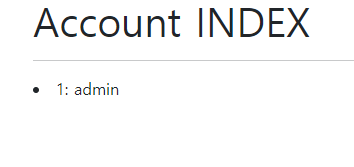

# CRUD

복습겸 처음부터 만들어보는 페이지

목표

- article CRUD, account CRUD, comment CRUD 구현하기
- 모르면 공식문서 찾아보기
- 구글링, 이전에 했던 프로젝트 파일 최대한 건드리지 않기


#### 0. 준비

가상환경 세팅

- `pip install -r requirements` :
  - requirments bootstrap v5, Pillow, ipython

settings.py

- ```python
  # settings.py
  INSTALLED_APPS = [
      'articles',
      'accounts',
      'bootstrap5',
      # 뒷부분 생략
  ]
  # 뒷부분 생략
  # Static files (CSS, JavaScript, Images)
  # https://docs.djangoproject.com/en/3.1/howto/static-files/
  
  STATIC_URL = '/static/'
  
  STATICFILES_DIRS = [
      BASE_DIR / 'crud' / 'static',
      ]
  
  MEDIA_ROOT = BASE_DIR / 'media'
   
  MEDIA_URL = '/media/'
  
  # customUserForm
  AUTH_USER_MODEL = 'accounts.User'
  ```


model, modelForm 

- article, comment model을 잡으려고했는데 잘되는지 모르겠다.

  - comment 부분에 article의 정보를 foreignKey로 가져오고, Article 부분에 user의 정보를 foreignKey로 가져온다. -> 이부분은 잘 몰라서 베꼈다.
    - `from django.conf import settings`
    - Article - `user = models.ForeignKey(settings.AUTH_USER_MODEL, on_delete=models.CASCADE)`
    - Comment - `article = models.ForeignKey(Article, on_delete=models.CASCADE)`
  - 해당 모델을 가지고 form도 만들어준다.

- User modelForm 을 만들때는 creation과 change는 꼭 만든다.

  - ```python
    from django.db import models
    from django.contrib.auth.models import AbstractUser
    
    # Create your models here.
    class User(AbstractUser):
        pass
    ```

  - ```python
    from django.contrib.auth.forms import UserChangeForm, UserCreationForm
    from django.contrib.auth import get_user_model
    
    class CustomUserCreationFrom(UserCreationForm):
    
        class Meta(UserCreationForm.Meta):
            model = get_user_model()
            fields = UserCreationForm.Meta.fields
            
    
    class CustomUserChangeFrom(UserChangeForm):
    
        class Meta(UserChangeForm.Meta):
            model = get_user_model()
            fields = ('email', 'first_name', 'last_name')
    ```

- 마이그레이션을 진행하여 되는지 확인


BaseTemplate 작성

- settings에 연결, crud / templates / base.html 작성
- cdn을 직접 붙여넣지 않고 bootstrap load
  - 잘못적어서 에러가 났다.
  - ``
  - `` -> ``
  - `` -> ``
- navbar부분은 include해서 사용
- content block을 만들어서 다른 템플릿을 넣을수 있게 제작


#### 1. account CRUD

article은 쉽게 만들수 있으니까 뒤로 미루고 복습할겸 account 페이지부터 만든다

기능들을 확인하기 위해 superuser를 하나 만들었다.

1. index page: USER가 몇명있는지 확인하기위한 페이지 (Read)

   ```python
   from django.contrib.auth import get_user_model
   def index(request):
       users = get_user_model().objects.all()
       context = {
           'users': users,
       }
       return render(request, 'accounts/index.html', context)
   ```

   

2. Login, Logout: User값이 바뀌는지 확인하기 위한 페이지

   1. 처음 들어갔을때 로그인 폼을 보여주어야함
      - `AuthenticationForm` 을 생각하지 못했다.
      - form을 보여줘야하는 건 알았는데 무슨 폼이었더라...
   2. 로그인 폼을 받으면 해당 유저를 찾아서 세션으로 반환
      - `login` 할때 세션을 반환해주는데 user를 어떻게 가져와야하는지 생각하지 못했다.
      - form을 만들면 `form.get_user()`로  받아올수있었다.
   3. (option) 이미 로그인 되어있으면 첫페이지로 되돌림, navbar에 login 추가

   ```python
   from django.contrib.auth import login as auth_login
   from django.contrib.auth.forms import AuthenticationForm
   
   @require_http_methods(['GET','POST'])
   def login(request):
       if request.user.is_authenticated:
           return redirect('accounts:index')
   
       if request.method == 'POST':
           form = AuthenticationForm(request, data=request.POST)
           if form.is_valid():
               auth_login(request, form.get_user())
               return redirect('accounts:index')
       else:
           form = AuthenticationForm()
       context ={
           'form': form,
       }
       return render(request, 'accounts/login.html', context)
   ```

   - submit 버튼을 눌러도 로그인이 되지않는다. 
   - 꼼꼼히 찾아보니 `request.method=="POST"` 부분을 `request.POST=="POST"`로 적었다.
   - 고치니까 sessionid 잘 들어온다.

   4. Logout은 로그인이 되어있을때만 들어갈수 있게 데코레이터를 붙인다.
      - `from django.contrib.auth.decorators import login_required`
   5. login 과 마찬가지로 logout 을 import 시켜서 사용함
   6. `accounts/index.html`에서 누가 로그인 되었는지 확인 ` <h2>Hello, {{ request.user }}</h2>`

3. Signup(Create)

   CustomCreateForm 사용. # 0.준비 부분에서 먼저 만들었음

   1. 빈 폼을 먼저 보여주고 POST로 들어오면 유저 생성

      - 데코레이터 설정(`@require_http_methods(['GET','POST'])`)

      ```python
      @require_http_methods(['GET','POST'])
      def signup(request):
          if request.method == 'POST':
              form = CustomUserCreationFrom(request.POST)
              if form.is_valid():
                  form.save()
                  return redirect('accounts:index')
          else:
              form = CustomUserCreationFrom()
          context = {
              'form': form,
          }
          return render(request, 'accounts/signup.html', context)
      ```

   2. `signup.html`은 `login.html`에서 글자만 변경함

   3. 회원가입하면 바로 로그인되는걸 어떻게 하는지 모르겠음

      - form.save() 할때 new_user로 받아서 auth_login (request, new_user)를 하니 로그인됨

      - ```python
        if form.is_valid():
                    new_user = form.save()
                    auth_login(request, new_user)
                    return redirect('accounts:index')
        ```

4. 회원정보 수정(Update)

   영어로 어떻게 해야할까 Edit Profile?

   1. 로그인 된 경우에만 가능하게 데코레이터 설정
   2. create와 같이 CustomUserChangeForm을 사용. 
      1. 해당 유저의 정보를 가져오면 되므로 get_user나 get_user_model사용하면 될듯
      2. 수정 가능한 폼보여주고 POST시 업데이트
      3. 로그인했을때 해당 유저의 정보를 가져와야함. 어떻게?
      4. instance를 넣는건 검색을통해서 알았으나 user를 어떻게 넣어야하는지 몰라서 이전 자료뒤져봤다. 근데 `request.user`로 그냥 넣어서 사용해서 허무했다.

5. 회원 탈퇴(Delete)

   1. 얘는 그냥 delete 해주면 되는 걸로 알고있있다. 
   2. 세션id도 계속 남으므로 삭제하고 logout시킨뒤 첫페이지로 되돌려주자
   3. 회원 정보 수정에서만 회원탈퇴가 가능하게 해야겠다. -> 데코레이터는 POST

   ```python
   @require_POST
   def delete(request):
       request.user.delete()
       auth_logout(request)
       return redirect('accounts:index')
   ```

6. password 변경

   정보변경 폼에서 비밀번호 변경할수있는 링크가 있어서 거기와 연결시켰다.

   ```python
   from django.contrib.auth.forms import PasswordChangeForm
   
   @login_required
   @require_http_methods(['GET','POST'])
   def password(request):
       if request.method == "POST":
           form = PasswordChangeForm(request.user, request.POST)
           if form.is_valid():
               form.save()
               update_session_auth_hash(request, form.user)
               return redirect('accounts:index')
       else:
           form = PasswordChangeForm(request.user)
       context = {
           'form': form,
       }
       return render(request, 'accounts/change_password.html', context)
       
   ```

   - 다른건 다 이해했는데 이해가 부족한 부분은 update_session부분이다.
   - 비밀번호를 바꾸었기때문에 세션값을 새로 준다는 뜻이겠지?

7. 사실 index는 필요없는 부분이라 모든 부분들을 다시 `articles:index`로 바꿔놓을 것이다. index 페이지는 superuser인경우만 들어올수 있게 만들었다.

   ```python
   @require_safe
   def index(request):
       if request.user.is_superuser:
           users = get_user_model().objects.all()
           context = {
               'users': users,
           }
           return render(request, 'accounts/index.html', context)
       else:
           return redirect('articles:index')
   
   ```

   

#### 2. Article CRUD

초기 환경 세팅과 account CRUD 부분은 기억이 이제 가물가물하다. 빠르게 article crud를 만들수 있겠지.

url은 한꺼번에 만들고, views에 들어가는 함수는 빈 함수로 만든다. 템플릿은 함수를 채워가면서 만들것이다.

1. Index - Read 

   1. 뭐 만들었다.

2. Create

   1. 에러가 계속떠서 확인해보니 게시글에 유저가 계속 들어가야한다고 에러가떴다.
   2. 해결한줄 알았는데 익명일때는 유저값이 안들어가서 에러를 뱉어준다.
      - 데코레이터를 붙여서 로그인 했을때만 들어갈수있게 만들었다. `@login_required`
      - `@login_required`말고 `is_authenticated`를 사용해서 로그인 페이지로 연결하는 걸로 바꿨다.
   3. 사진을 넣을수 있게 할까 고민중이다. 모델은 사진을 받을 곳이 없긴하다

3. Detail - Read 

   이것도 쉽게 클리어

   1. `get_object_or_404`를 사용해서 값을 받아오고 render할때 값으로 넘겨줬다.

4. Update

   1. 아티클을 받아오고 아티클 폼에 인스턴스로 넘겨주어서 업데이트를 만들었다.
   2. request.user가 article.user가 아니면 삭제가 안되게 해줬다.

5. Delete

   1. request.user가 article.user가 아니면 삭제가 안되게 해줬다.
      - 아닐경우 알람을 띄우고 싶은데 어떻게 해야할지 모르겠다. 장고에서는 불가능하겠지?
   2. 계속 에러가 많이 떴는데 reverse 어쩌구였다. detail 템플릿과 delete 함수에서 article.pk을 안넘겨줘서 넣어주니 해결

6. detail 페이지에서 article.user와 request.user가 같아야 update, delete버튼이 뜨게 수정했다.

7. 최종? 코드

   ```python
   from articles.forms import ArticleForm
   from django.shortcuts import redirect, render, get_object_or_404
   from django.contrib.auth.decorators import login_required
   from django.views.decorators.http import require_POST, require_http_methods, require_safe
   
   # Create your views here.
   @require_safe
   def index(request):
       articles = Article.objects.all()
       context={
           'articles': articles,
       }
       return render(request, 'articles/index.html', context)
   
   
   @require_http_methods(['GET','POST'])
   def create(request):
       if not request.user.is_authenticated:
           return redirect('accounts:login')
       if request.method == "POST":
           form = ArticleForm(request.POST)
           if form.is_valid():
               article = form.save(commit=False)
               article.user = request.user
               article.save()
               return redirect('articles:index')
       else:
           form = ArticleForm()
       context = {
           'form': form,
       }
       return render(request, 'articles/create.html',context)
   
   @require_safe
   def detail(request, article_pk):
       article = get_object_or_404(Article, pk=article_pk)
       context={
           'article': article,
       }
       return render(request, 'articles/detail.html', context)
   
   @require_http_methods(['GET','POST'])
   def update(request, article_pk):
       article = get_object_or_404(Article, pk=article_pk)
       if request.user == article.user:
           if request.method == "POST":
               form = ArticleForm(request.POST, instance=article)
               if form.is_valid():
                   form.save()
                   return redirect('articles:detail', article_pk)
           else:
               form = ArticleForm(instance=article)
           context={
               'form': form,
           }
           return render(request, 'articles/update.html', context)
       else:
           return redirect('articles:detail', article_pk)    
   
   @require_POST
   def delete(request, article_pk):
       article = Article.objects.get(pk=article_pk)
       #article = get_object_or_404(Article, pk=article_pk)
       if request.user == article.user:
           article.delete()
           return redirect('articles:index')
       # 삭제안된다는 알람
       return redirect('articles:detail', article_pk)
   ```

   

#### 3. comment CRUD

댓글은 detail에서 이미 다 보여주므로 POST 기능으로만 구현하면 된다.

1. READ
   - `comments = article.comment_set.all()` 로 역참조를 하여 모든 댓글을 불러온다.
   - detail 템플릿에서 사용할 commentForm 도 받아서 context로 넘겨준다.
   - detail 템플릿에서는 for 문을 사용해서 넣고 없을땐 Nocomments라는 문구를 보여준다
   - 수정 삭제 버튼도 request 유저와 comment 유저가 같을때만 보여준다.
   - 댓글을 작성할수 있는 form 도 작성하였다.
2. 댓글 추가 기능
   - 로그인했을때만 댓글을 달수 있도록 했다
   - login required 데코레이터를 사용하려했지만, 로그인페이지로 넘기는게 나아서 사용하지 않았다.
   - article과 commentform을 받아서 저장시켰다.
   - 수정삭제 버튼이 보이지 않아서 수정하였다.
     - `` 인줄 알았으나 아니다. 이거는 해당글을 작성한 사람만 수정 삭제할수 있는 버튼이다.
     - comment model에 user가 들어있지 않아서 누가 썼는지 확인하지 못한다.
     - request 유저와 comment 유저가 같을때 보여주려면 모델에 user 값을 추가해야할듯
3. 댓글 삭제 기능
   - 모든 댓글을 삭제 할수 있게 만들었다.
   - 본인 댓글만 삭제 하려면 모델에 user값을 추가해야한다.
4. 댓글 업데이트 기능
   - 템플릿도 새로 만들어야하고 어차피 본인댓글을 수정하는게 아니기때문에 큰 의미가 없을거같아서 생략한다.
5. 최종 코드

```python
@require_POST
def comment(request, article_pk):
    if request.user.is_authenticated:
        article = get_object_or_404(Article, pk=article_pk)
        form = CommentForm(request.POST)
        if form.is_valid():
            comment = form.save(commit=False)
            comment.article = article
            comment.save()
        return redirect('articles:detail', article_pk)
    else:
        return redirect('accounts:login')

@require_POST    
def comment_delete(request, article_pk, comment_pk):
    if request.user.is_authenticated:
        article = get_object_or_404(Article, pk=article_pk)
        comment = get_object_or_404(Comment, pk=comment_pk)
        comment.delete()
        return redirect('articles:detail', article_pk)
    else:
        return redirect('accounts:login')
```


#### 4. 느낀점

이제 article crud 정도는 쉽게 할수 있고, comment crud는 적당히 할수 있는듯 하다.

물론 관계 설정시 1 : N을 생각해야하는데 어떤것을 넣어주어야할지 잘 모르겠다.

그리고 아직 어려운 부분은 account로 user 기능을 구현할때이다.

유저 모델은 처음에 `AUTH_USER_MODEL = 'accounts.User'` 이걸 설정해줘야하고, account 부분에 모델을 상속받아서 커스텀 모델을 만들어야한다.

이부분을 처음 만들때 생각해야하는데 할수 있을지 모르겠다.

여러번 하다보면 손에 익든, 머리에 익든 하겠지...

