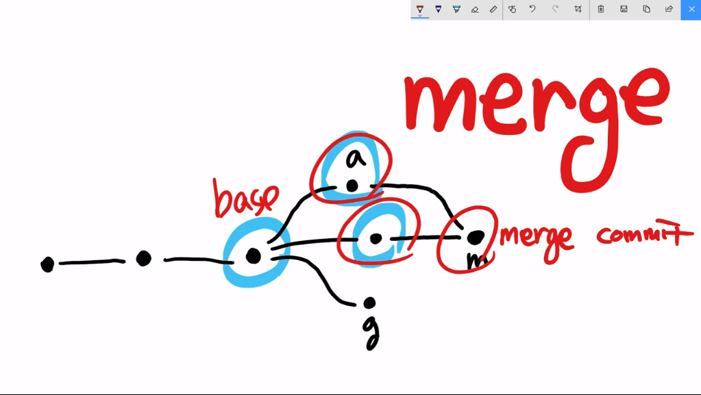
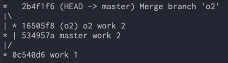
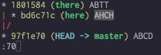

# Git 생활코딩

## 0. Git 설치

다음 주소에서 Git설치

https://git-scm.com

설치시 바꿀만한 것 없이 대부분 Next

- 굳이 할필요는 없는거 같지만 check daily for git for windows updates 체크했음

git bash에 다음 명령어를 입력

```shell
$ git
```

사용할수 있는 명령어들과 설명이 출력되면 제대로 설치된것.

usage: git [--version] [--help] [-C <path>] [-c <name>=<value>]
           [--exec-path[=<path>]] [--html-path] [--man-path] [--info-path]
           [-p | --paginate | -P | --no-pager] [--no-replace-objects] [--bare]
           [--git-dir=<path>] [--work-tree=<path>] [--namespace=<name>]
           <command> [<args>]


## 1. Git

### Git의 목적

1. 버전관리
   - 바뀔때마다 확인 가능.
   - 이전 내용과 변경 사항이 있는지 파악 가능
2. 백업
   - Local repository -> 내 컴퓨터
   - Remote repositoty -> GitHub 등. 클라우드 같은거.
   - Push: Local -> Remote; 내 파일을 원격 저장소에 밀어낸다. (저장한다.)
   - Pull: Local <- Remote; 원격 저장소의 파일을 내 폴더에 가져온다.(동기화 시킨다.)
3. 협업


## 2. Git - 버전관리

1. 버전 관리의 시작

2. 버전의 생성

   - Working Tree: 내가 일하는 공간
   - Staging Area: 버전을 만들고 싶은 파일이 있는 공간
   - Repository: 만들어진 버전

   `$ git status` 

   - Untracked files: 추적하지 않는다.

   `$ git add <file name>`

   - Staging에 올림
   - 여러 파일을 설정할수 있음

   ` $ git commit -m 'Message'`

   - repo로 옮김

   `$ git log`

   - commit 내역을 볼수있다.

   - `git log --stat`: 어떤 파일이 연결되었는지 확인가능
   - `git log -p`:이전 버전과 비교 가능(추가된 내용,파일) 

3. 버전간의 차이점 비교

   - `git diff`

4. checkout과 시간여행

   - `git checkout <commit_id>`

     - 해당 시점의 파일을 확인함
     - `git status`확인시 `HEAD detached at <commit_id>`

   - `git log` 

     ``` shell
     commit <commit_id2> (HEAD)
     Author: -
     Date: Mon Jan 15 22:15:35 2018 +0900
     
         Message 1
         
     commit <commit_id1>
     Author: -
     Date: Mon Jan 15 22:14:16 2018 +0900
     
         Initial commit
     
     ```

     - <commit_id1>, <commit_id2>로 이동할수있음

   - `git checkout master`: master(최신상태)로 돌아감.

     ``` shell
     commit <commit_id3> (HEAD -> master, origin/master, origin/HEAD)
     Author: -
     Date:   Tue Jan 19 17:46:45 2021 +0900
     
         Message 2
     
     commit <commit_id2>
     Author: -
     Date:   Mon Jan 15 22:15:35 2018 +0900
     
         Message 1
     
     commit <commit_id1>
     Author: -
     Date: Mon Jan 15 22:14:16 2018 +0900
     
         Initial commit
     
     ```

5. 보충수업

   - `git add .`: 모든 파일 add

   - `git commit -am 'message'`: 한번이라도 track된 파일만 add commit 동시 수행

   - `git commit`: 아무 명령어를 안치면 txt 파일로 메세지를 남길수있음

     - `git config --global core.editor "nano"`

       파일을 편집할때 기본적으로 사용하는 편집기 설정

6. 버전 삭제

   - `git reset --hard <commit_id>`
     - 해당 버전으로 리셋
     - 해당 버전 이후의 커밋들은 사라짐
     - 협업할때는 조심해서 사용할것

7. 버전 되돌리기

   - `git revert --hard`:이전 버전으로 돌아갈수있음
   - revert 시 기존의 커밋은 살려두고 이전 커밋으로 돌아갈수있음
     - 이전 커밋을 기존 커밋 다음으로 가져옴.
   - 여러 단계를 한번에 revert하면 충돌이 생길수있음
     - 충돌(confict)을 배우지 않은 상태에서는 한 단계 씩만 돌아갈것

8. 다음 내용

   - diff tool
   - .gitignore: 버전관리를 하고 싶지 않은 경우 해당 파일을 생성
   - branch:
   - tag: commit id는 외우기 어려우니 이름을 설정해서 돌아갈수있음
   - backup


## 3. Git - Branch & Confilct

1. 수업소개

2. 실습준비

   1. `git init`

   2. `work.txt`, `git add work.txt` `git commit -m 'work 1 for git branch'`

      ``` 
      content1
      ```

      - web1에 commit이 여러개 생성있어서 간단한 내용으로 커밋 

3. 브랜치의 기본사용법

   1. `git log --all --graph --oneline`

      `--all`: 모든 브랜치 확인

      `--graph`: 시각적으로 표현

      ``--oneline`: 한 줄로 출력

      ``` shell
      https://github.com/dongjuk157/web1
      
      $ git log --all --graph --oneline
      * 30f07aa (HEAD -> master) work 1 for git branch
      * 52eba66 (origin/master, origin/HEAD) message 2
      * 373b43d message 1
      * 5ca13da first version
      * 0848f0b Initial commit
      ```

   2. `git branch`: branch 목록을 출력하고 현재 있는 branch를 보여줌

      ```shell
      *master
      ```

      `git branch <branch_name>`: `<branch_name>`이라는 branch를 생성. 

      apple, google, ms생성한뒤 확인

      ```shell
      $ git branch
        apple
        google
      * master
        ms
      ```

   3. `git log --all --graph --oneline`

      ``` shell
      $ git log --all --graph --oneline
      * 30f07aa (HEAD -> master, ms, google, apple) work 1 for git branch
      * 52eba66 (origin/master, origin/HEAD) message 2
      * 373b43d message 1
      * 5ca13da first version
      * 0848f0b Initial commit
      ```

   4. `work.txt`에 `content 2 content3 master content 4` 추가 후 커밋

      ``` shell
      $ git log --all --graph --oneline
      * 7519479 (HEAD -> master) master work 4
      * 30f07aa (ms, google, apple) work 1 for git branch
      * 52eba66 (origin/master, origin/HEAD) message 2
      * 373b43d message 1
      * 5ca13da first version
      * 0848f0b Initial commit
      ```

      - HEAD는 master를 가리킴
      - ms, google, apple는 아직 work 1 for git branch를 가리키고 있음

   5. `git checkout <branch_name>`:  해당 이름의 브랜치로 옮김

      변경된 것

      - 뒤에 붙는 이름이 바뀜

      ``` shell
      DG@--------------- MINGW64 ~/~~~~~~~/~~~~~/web1 (master)
      $ git checkout apple
      Switched to branch 'apple'
      
      DG@--------------- MINGW64 ~/~~~~~~~/~~~~~/web1 (apple)
      ```

      - HEAD가 apple을 가리킴

      ```shell
      $ git log --all --graph --oneline
      * 7519479 (master) master work 4
      * 30f07aa (HEAD -> apple, ms, google) work 1 for git branch
      * 52eba66 (origin/master, origin/HEAD) message 2
      * 373b43d message 1
      * 5ca13da first version
      * 0848f0b Initial commit
      ```

      - `work.txt`의 내용은 `content 1`만 있음

   6. `apple`을 가리킨 상태

      - `work.txt`에 내용 `apple work 4` 추가
      - `apple.txt` 생성 후 내용 `apple work 4`추가
      - `git add .` `git commit -m 'apple work 4'`

   7. 같은방법(5,6)으로 google, ms 도 작업한뒤 확인

      ``` shell
      $ git log --all --graph --oneline
      * 5a5e2a5 (HEAD -> ms) ms work 4
      | * c4e9dfa (google) google work 4
      |/
      | * 7119ac9 (apple) apple work 4
      |/
      | * 7519479 (master) master work 4
      |/
      * 30f07aa work 1 for git branch
      * 52eba66 (origin/master, origin/HEAD) message 2
      * 373b43d message 1
      * 5ca13da first version
      * 0848f0b Initial commit
      ```

      - Branch를 통해서 원하는 곳으로 옮길수 있음. 
      - 한 저장소에서 공통 부분을 공유하면서 본인만의 작업을 수행할 수 있음(가장 큰 장점)

4. Merge 병합 (2way merge)

   다른 Branch에서 사용된 것이 유용하다고 생각될때 합친 버전을 만드는 작업

   

   1. master에 apple의 내용을 합쳐서 master 아래에 새로운 버전을 만듦

      1. `git checkout master`: 합치려는 branch로 이동
      2. `git merge <branch_name>` : branch를 현재의 branch에 병합

   2. 서로 다른 파일 병합

      - `master branch`-`work.txt`
      - `o2 branch`- `o2.txt`
      - 두 branch를 병합했을때 두 파일이 모두 있는 merge branch 생성

      

   3. 같은파일, 다른부분 병합

      - `master branch`-`work.txt`

        ``` shell
        $ nano work.txt
        
        # title
        master content
        
        # title
        content 
        ```

      - `o2 branch`- `work.txt`

        ``` shell
        $ nano work.txt
        
        # title
        content
        
        # title
        o2 content 
        ```

      - 두 branch를 병합했을때 수정된 파일이 있는 merge branch 생성

        ``` shell
        $ nano work.txt
        
        # title
        master content
        
        # title
        o2 content 
        ```

   4. 같은파일, 같은부분 병합

      - `master branch`-`work.txt`

      ``` shell
      $ nano work.txt
      
      # title
      content
      master
      # title
      content 
      ```

      - `o2 branch`-`work.txt`

      ```sh
      $ nano work.txt
      
      # title
      content
      o2
      # title
      content 
      ```

      - conflict 발생

      ```shell
      $ git merge o2
      Auto-merging work.txt
      CONFLICT (content): Merge conflict in work.txt
      Automatic merge failed; fix conflicts and then commit the result.
      ```

      ​	충돌된 해당 부분만 고치면 나머지는 자동으로 합쳐짐

      - `git status`: 충돌된 파일 확인 가능.

      ```shell
      $ git status
      On branch master
      You have unmerged paths.
        (fix conflicts and run "git commit")
        (use "git merge --abort" to abort the merge)
      
      Unmerged paths:
        (use "git add <file>..." to mark resolution)
              both modified:   work.txt
      ```

      - 충돌난 파일에서 수정하면 merge 가능

        충돌난 부분(HEAD 내용, 구분선, o2내용)을 보여줌

        이 부분을 수정하고 add commit 하면 merge 완료

      ```shell 
      $ nano work.txt
      
      # title
      content
      <<<<<<< HEAD
      master
      =======
      o2
      >>>>>>> o2
      # title
      content 
      ```

   - `git commit --amend`: commit된 메세지를 수정할 수 있음

5. 3 way merge

   2 way merge에서는 충돌이 나는 부분을 어느정도 처리해줌

   | here | base | there | 2 way merge | 3 way merge |
   | ---- | ---- | ----- | ----------- | ----------- |
   | A    | A    | A     | A           | A           |
   | H    | B    | B     | Conflict    | H           |
   | C    | C    | T     | Conflict    | T           |
   | H    | D    | T     | Conflict    | Conflict    |

   - Base(공통 조상)와 비교했을때 한 부분(here,there 중 하나)이 변경되면 변경된 것을 따라감
   - 양쪽이 모두 변경된 부분만 사용자가 처리

6. 외부도구를 이용한 병합

   

   1. `here`에서 `there`를 병합을 하면 3 way merge로 병합
   2. `git mergetool`을 사용하면 외부 도구를 하면됨
      1. `git config --global merge.tool <program_name>`
      2. ex: `p4mergetool`:P4Merge. 설정은 프로그램 설명을 보면서 설정

8. 부록 

   1. 아직 이해가 부족하다. 다음에 몇 번 더 듣자.
   2. https://git-scm.com/book/ko/v2/Git-%EB%8F%84%EA%B5%AC-Reset-%EB%AA%85%ED%99%95%ED%9E%88-%EC%95%8C%EA%B3%A0-%EA%B0%80%EA%B8%B0
   3. HEAD/BRANCH/COMMIT
      1. `.git`폴더에 `HEAD` 파일 존재
      2. 현재 저장소의 버전을 알 수 있음
   4. CHECKOUT 
      1. HEAD의 값을 바꿈
      2. HEAD가 BRANCH를 가리키지 않고 버전을 직접 가리킬 수 있음
         - Detached
   5. RESET 
      1. 현재 branch의 버전을 master가 가리키고 있는 버전을 가리킴
      2. 이후의 커밋들은 추적 불가능(delete 느낌)


## 4. Git - Backup

1. 수업소개

   - 백업의 필요성
   - git hosting: Github, Gitlab

2. 수업의 목표와 용어정리

   - Local Repository: 지역
   - Remote Repository: 원격
   - Push: local을 remote로 옮기는 작업(업로드, 백업)
   - Pull: remote에서 local로 옮기는 작업(다운로드)

3. 공부의 방향

   - HTTP:
   - SSH: 보안이 강력하지만 어려움

4. 원격저장소와 연결

   - HTTPS 주소를 복사
   - `$ git remote add origin <remote_repo_address>`: 원격저장소 연결(주소 저장)
   - `$ git remote -v`:원격저장소의 주소를 알수있음

5. Push, Clone, Pull

   - `git push --set-upstream origin master`
     - 어떤 저장소가 기본인지 지정
     - 이후엔 `git push`만 해도 올라감
   - 처음 사용할땐 계정 연결 필수 

   - `git clone <remote_repo_address>`: 명령을 진행한 폴더에 디렉토리 생성
   - `git pull origin master`

6. 다음 배울 내용

   - 자동 인증(SSH)
   - 이슈 트래커
   - 협업 기능 -> 충돌관리


## 5. Git - 협업

1. 같이 작업하기

   1. Collaborator 추가

2. Push & Pull

   1. commit id가 다른상태에서 `git push` 를 하면 reject 발생
   2. 이 상태에서 `git pull` 사용하면 conflict 발생. 
   3. conflict 처리후 `git push` 가능

3. 원격 브랜치와 fetch

   1. remote branch: 오른쪽에 있는 것이 원격 브랜치

      ``` shell
      $ git log
      <commit_id> (HEAD -> master, origin/master, origin/HEAD)
      ```

   2. FETCH

      `git fetch`: 원격 브랜치를 최신 상태로 변화. 병합은 나중에 하고 싶은 경우 사용

      `git merge`: 병합

      `git pull`: `git fetch`+`git merge`


## 6. Git - Cherry-pick & rebase


## 7. Git - github.com Pull request


---

These are common Git commands used in various situations:

start a working area (see also: git help tutorial)

> clone: Clone a repository into a new directory 
>
> - 새로운 디렉토리에 repository를 복제 
> - 원격저장소에 있는 repository를 로컬 저장소에 저장하는 명령어
>
> init: Create an empty Git repository or reinitialize an existing one
>
> - 빈 Git 저장소를 만들거나 기존 저장소를 다시 초기화

work on the current change (see also: git help everyday)

> add: Add file contents to the index
>
> mv: Move or rename a file, a directory, or a symlink
>
> restore: Restore working tree files
>
> rm: Remove files from the working tree and from the index
>
> sparse-checkout: Initialize and modify the sparse-checkout

examine the history and state (see also: git help revisions)

> bisect: Use binary search to find the commit that introduced a bug
>
> diff: Show changes between commits, commit and working tree, etc
>
> grep: Print lines matching a pattern
>
> log: Show commit logs
>
> show: Show various types of objects
>
> status: Show the working tree status

grow, mark and tweak your common history

> branch: List, create, or delete branches
>
> commit: Record changes to the repository
>
> merge: Join two or more development histories together
>
> rebase: Reapply commits on top of another base tip
>
> reset: Reset current HEAD to the specified state
>
> switch: Switch branches
>
> tag: Create, list, delete or verify a tag object signed with GPG

collaborate (see also: git help workflows)

> fetch: Download objects and refs from another repository
>
> pull: Fetch from and integrate with another repository or a local branch
>
> push: Update remote refs along with associated objects

'git help -a' and 'git help -g' list available subcommands and some concept guides. See 'git help <command>' or 'git help <concept>' to read about a specific subcommand or concept. See 'git help git' for an overview of the system.

***

``` shell
$ git help tutorial
```

> It is a good idea to __introduce yourself__ to Git with your name and public email address before doing any operation. The easiest way to do so is:
>
> ``` shell
> $ git config --global user.name "Your Name Comes Here"
> $ git config --global user.email you@yourdomain.example.com
> ```
>
> ###### __Importing a new project__
>
> ``` shell
> $ cd project
> $ git init
> ```
>
> git will reply
>
> ``` shell
> Initialized empty Git repository in .git/
> ```
>
> You’ve now __initialized the working directory__—you may notice a new directory created, named ".git".
>
> Next, tell Git to __take a snapshot of the contents of all files under the current directory__ (note the *.*), with *git add*: 
>
> - comma를 사용하면 현재 폴더 아래의 모든 파일들의 스냅샷을 찍음
> - 특정 파일만 하려면 add 뒤에 comma말고 파일의 이름을 적음
>
> ```shell
> $ git add .
> ```
>
> __This snapshot is now stored in a temporary staging area__ which Git calls the "index". You can permanently store the contents of the index in the repository with *git commit*:
>
> ```shell
> $ git commit
> ```
>
> 

---

##### 참고한 블로그

https://goddaehee.tistory.com/216