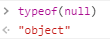

[toc]

# JavaScript

## ECMAScript 6

ECMA: 정보통신에 대한 표준을 제정하는 기구

- ES6: ECMAScript 6, ECMAScript 2015

Features [참고](http://es6-features.org/)

- Classes (Constructor method, Class inheritance)
- Const, Let
- Arrow function
- Modules
- Promises


## Identifier 식별자

변수를 구분할수 있는 이름

### 특징

- 문자, `$`, `_` 로 시작

- 대소문자 구분

### 식별자 작성 스타일

1. 카멜 케이스 (`camelCase`): 변수, 객체, 함수에 사용
2. 파스칼 케이스 (`PascalCase`): 클래스, 생성자에 사용
3. 스네이크 케이스 (`SNAKE_CASE`): 상수에 사용


## Variables 변수

### let

```js
let a = 1		// 선언, 할당
a = 2			// 재할당 가능
let a = 2		// 재선언 불가능
```

- 재선언 불가능
- 재할당 가능
- 블록 스코프


### const

```js
const b = 1		// 선언, 할당
b = 2			// 재할당 불가능
const b = 2		// 재선언 불가능
const b			// 나누어서 사용 불가
b = 2 
```

- 재선언 불가능
- 재할당 불가능
- 블록 스코프


### var

```js
console.log(c)	// undefined 출력(hoisting)
var c = 1		// 선언, 할당
c = 2			// 재할당 가능
var c = 3		// 재선언 가능
```


- 재선언 가능
- 재할당 가능
- 호이스팅 Hoisting
  - 변수 선언 이전에 참조할수 있는 현상
    - 아래에서 선언해도 위에서 변수에 접근할수있음(undefined 반환)
  - 이 특성으로 인해 ES6이후 var는 사용하지 않을 것을 권장함
- 함수 스코프


### 블록 스코프, 함수 스코프

블록 스코프 Block scope

- 블록: if, for, 함수 등의 중괄호 내부
- 블록 바깥에서 블록 내부의 변수에 접근할수 없음

함수 스코프 Function scope

- 함수의 중괄호 내부를 가리킴


## Data Type 데이터 타입

Primitive type, Reference type 으로 분류됨

### Primitive Type 원시 타입

#### 특징

Object(객체)가 아닌 기본 타입

변수에 해당 타입의 값이 담김

다른 변수에 복사할때 실제 값이 복사됨

#### Number 숫자 타입

정수, 실수 구분없음

부동소수점 형식

(+) NaN(Not-A-Number): 계산 불가능한 경우 반환되는 값. type은 Number

#### String 문자열 타입

텍스트 데이터, 16비트 유니코드 문자의 집합

single quotes(''), double quotes(""),  backtick(``)사용가능

Template Literal

```js
const name = "Paul"
console.log(`Hello, ${name}!`)
// Hello, Paul!
```

- ES6 부터 지원
- ${expression} 형태로 표현식 삽입 가능

#### Undefined

변수 선언이후 값을 할당하지 않으면 자동 할당

#### Null

변수 값이 없음을 의도적으로 표현

ECMA 명세의 원시타입에 정의에 따라 원시 타입에 속함

하지만 typeof 연산자의 결과는 object로 표현됨



#### Boolean

논리적 참거짓 true, false

조건문, 반복문에서 boolean이 아닌 데이터 타입은 자동형변환 규칙에 따라 boolean(true/false)으로 변환됨

- Undefined, Null: `false`
- Number
  - `0`, `-0`, `NaN` :`false` 
  - 나머지: `true`
- String
  - 빈 문자열 :`false` 
  - 나머지: `true`
- Object: `true`


### Reference Type 참조 타입

Object(객체) 타입의 자료형

변수에 해당 객체의 참조값이 담김

다른 변수에 복사할때 참조값이 복사됨

#### Functions 함수

[함수](##Functions-함수)

#### Arrays 배열

[배열](##Arrays-배열)

#### Objects 객체

[객체](##Objects-객체)


#### First-class citizens 일급 객체

다음 특징을 만족하는 객체

- 변수에 할당가능
- 함수의 매개변수로 전달가능
- 함수의 반환 값으로 사용가능


## Operators 연산자

할당연산자: 변수에 할당

비교연산자: boolean으로 반환 

- 동등 비교 연산자 `==, !=`

  암묵적 형변환을 통해 타입을 일치 시킨후 같은 값인지 비교

  객체 끼리 비교하는 경우 메모리의 같은 객체를 참조하는지 판별

- 일치 비교 연산자 `===, !==`

  타입과 값이 모두 같은지 비교

  객체 끼리 비교하는 경우 메모리의 같은 객체를 참조하는지 판별

논리연산자 `&&`,`||`,`!`

- 삼항연산자 `expression ? true value : false value`


## Conditions 조건문, Loops 반복문

내부: 블록 스코프

### 조건문

if statement

switch statement

### 반복문

while statement

for statement

- `for (attr in object){}`: 객체 속성들을 순회할때 사용
- `for (item of iterables){}`: 배열 등 반복 가능한 객체를 순회할때 사용


## Functions 함수

JS의 함수는 일급 객체


### function declaration 함수 선언식

```js
function greeting(name = 'Anonymous'){ // 기본 인자 선언 가능(함수 표현식에서도 가능)
    return `Hello, ${name}!`
}
```

함수의 이름과 함께 정의하는 방식

Hoisting이 됨(권장하지 않는 방식)


### function expression 함수 표현식

``` js
const myFunc = function greeting(name = 'Anonymous'){
    return `Hello, ${name}!`
}
const myFunc2 = function (name = 'Anonymous'){ // 익명함수
    return `Hello, ${name}!`
} 
```

함수를 표현식 내에서 정의하는 방식

함수표현식에서만 함수 이름을 생략하고 정의 가능


### Arrow Function

```js
// 1 function 키워드 삭제 arrow로 변환
const bye1 = (name) => {
    return `Bye, ${name}!`
}
// 2 함수의 매개변수가 하나인경우 `()` 생략 가능.
const bye2 = name => {
    return `Bye, ${name}!`
}
// 3 블록내 표현식이 하나라면 `{}` 과 `return` 생략 가능
const bye3 = name => `Bye, ${name}!`
// (+) Airbnb 스타일 가이드. 3까지 생략해도 보기 좋게 표현
const bye3 = (name) => (`Bye, ${name}!`)
```

- function 키워드 삭제
- 함수의 매개변수가 하나인경우 `()` 생략 가능. 기본인자가 있는경우 생략 불가능
- 블록내 표현식이 하나라면 `{}` 과 `return` 생략가능


## Arrays 배열

```js
const numbers = [1,2,3,4,5]
console.log(numbers[0]) 	// 1
console.log(numbers[-1]) 	// undefined
console.log(numbers[numbers.length - 1])// 5
```

키와 속성을 담고있는 객체. 순서를 보장함.


### 배열 관련 메서드 

`array.method()`의 형태로 사용

- `reverse` : 원본 배열의 요소들을 반대로 정렬함
- `push & pop`: 배열의 뒷 부분에 요소를 추가. 배열의 마지막 요소를 제거
- `unshift & shift`: 배열의 첫 부분에 요소를 추가. 배열의 첫번째 요소를 제거
- `includes`: 배열에 특정값이 있는지 판별
- `indexOf`: 배열에 특정값이 있는지 확인후 인덱스 반환. 없는경우 -1 반환
- `join`: 모든 요소를 구분자를 이용하여 연결, 기본값은 `,`


### 배열 관련 메서드 2 

메서드 호출시 인자로 callback 함수를 받음.

callback 함수: 어떤 함수의 내부에서 실행될 목적으로 인자로 넘겨받는 함수

- `foreach`: 배열의 각 요소에 대해 콜백함수를 한번씩 실행. 반환값 없음

  ```js
  //array.forEach(callback(element[, index[, array]]))
  const arr = [1,2,3,4,5]
  arr.foreach((num)=>{
      console.log(num)
  }) // 1~5 출력
  ```

  Airbnb Style Guide 권장방식: 대부분의 브라우저 환경에서 지원

- `map`: 배열의 각 요소에 대해 콜백함수를 한번씩 실행하고, 반환값으로 새로운 배열을 만들어 반환

  ```js
  //array.map(callback(element[, index[, array]]))
  const arr = [1,2,3,4,5]
  const arr2 = arr.map((num)=>{
      return num*num
  }) // arr2 = [1,4,9,16,25]
  ```

- `filter`: 배열의 각 요소에 대해 콜백함수를 한번씩 실행하고, 반환값이 참인 요소들만 반환

  ```js
  //array.filter(callback(element[, index[, array]]))
  const arr = [1,2,3,4,5]
  const arr2 = arr.filter((num)=>{
      return num % 2
  }) // arr2 = [1,3,5]
  ```

- `reduce`: 배열의 각 요소에 대해 한번씩 실행하고 함수의 반환 값들을 누적후 반환

  ```js
  //array.reduce(callback(acc,element[, index[, array]])[,initialValue])
  const arr = [1,2,3,4,5]
  const sum = arr.reduce((num)=>{
      return acc + num
  }, 0) // sum = 15
  const scores = [
    { name: 'smith', score: 90 },
    { name: 'peter', score: 80 },
    { name: 'anna', score: 85 },
  ]
  const newScore = scores.reduce((acc, person) => {
    return {...acc, [person.name]: person.score}
  }, {}) // newScore = {'smith':90, 'peter':80, 'anna': 85 }
  ```

- `find`: 콜백함수의 반환값이 참이면 해당 요소(중복값의 경우 맨 처음값)를 반환, 없으면 undefined 반환

  ```js
  //array.find(callback(element[, index[, array]]))
  const person = [
      {name:'kim' age:32},
      {name:'park' age:25},
      {name:'lee' age:18},
      {name:'kim' age:70},
  ]
  const park = person.filter((p)=>{
      return p.name === 'park'
  }) // park = {name:'park' age:25}
  const kim = person.filter((p)=>{
      return p.name === 'kim'
  }) // kim = {name:'kim' age:32}
  ```

- `some`: 배열의 요소중 하나라도 참이면 참을 반환, 모든 요소가 거짓이면 거짓 반환

  - 빈 배열은 항상 거짓 반환

- `every`: 모든 요소가 참이면 참을 반환, 배열의 요소중 하나라도 거짓이면 거짓 반환

  - 빈 배열은 항상 참 반환


## Objects 객체

속성의 집합. 중괄호 내부에 key, value 쌍으로 표현

key는 문자열타입만 가능

- 띄어쓰기, `-`같은 구분자가 있을 경우 따옴표로 묶어서 표현 가능

value는 모든 타입 가능

객체 요소 접근은 `object.key` 혹은 `object[key]`로 가능

- 띄어쓰기 같은 구분자가 있을 경우 `object[key]`로만 접근 가능


### Shorthand 축약

1. 속성명 축약: 객체를 정의할때 key와 할당하는 변수의 이름이 같으면 축약 가능

   ```js
const coffee = ['Americano','Cafe Latte']
const tea = ['black tea', 'green tea']
const menu = {	// 이렇게 선언하는 것과 같음
    coffee,		// coffee: coffee,
    tea,			// tea: tea,
}
```

2. 메서드명 축약: 메서드 선언시 function 키워드 생략 가능

   ```js
   const obj = {				// const obj = {
       greeting(){				//     greeting: function () {
           console.log('Hi')	//         console.log('Hi')
       }						//     }
   }							// }
   obj.greeting()
```


### Computed Property Name 계산된 속성

객체를 정의할떄 key의 이름을 표현식으로 이용하여 동적으로 생성 가능

```js
const key = 'foods'
const value = ['burger', 'chicken', 'pizza', 'noodle']
const obj = {
    [key]: value,
} // obj = {foods: Array(4)}, obj.foods = ['burger', 'chicken', 'pizza', 'noodle']
```


### Destructing Assignment 구조 분해 할당

배열또는 객체를 분해하여 속성을 변수에 쉽게 할당

```js
const info = {
    name: 'lee',
    email: 'lee@email.com'
    call: '010-1234-5678'
}
const {name, email, call} = info
```


### JSON(JavaScript Object Notation)

 key-value쌍의 형태로 데이터를 표기하는 언어 독립적 표준 포맷

객체와 유사하게 생겼으나 문자열 타입임. parsing(구문 분석) 필수

- `JSON.parse()`: JSON(문자열) -> 객체
- `JSON.stringify()`: 객체 -> JSON(문자열)

